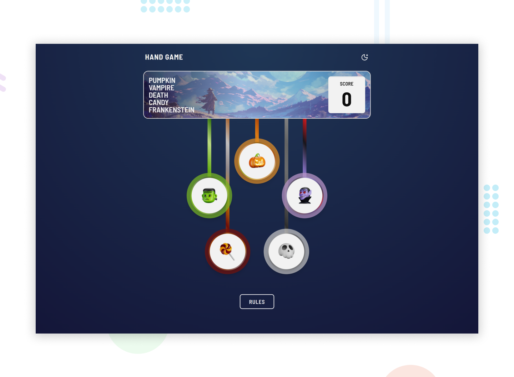

## Frontend Mentor - Rock, Paper, Scissors Solution

This is a solution to the [Rock, Paper, Scissors challenge on Frontend Mentor](https://www.frontendmentor.io/challenges/rock-paper-scissors-game-pTgwgvgH). Frontend Mentor challenges help you improve your coding skills by building realistic projects.

<p>
  <a href="">
    </a>
  <a href="https://haquanq-frontendmentor.github.io/rock-paper-scisoors/">
    </a>
  <a href="./LICENSE"
    ></a>
</p>

## Table of Contents

- [Project Overview](#sunrise-project-overview)
- [Tech Stack and Approach](#stars-tech-stack-and-approach)
- [Local Development](#leaves-local-development)
- [Deployment](#maple_leaf-deployment)

## :sunrise: Project Overview

### Challenge Requirements

- View the optimal layout for the game depending on their device's screen size
- Play Rock, Paper, Scissors against the computer
- Maintain the state of the score after refreshing the browser _(optional)_
- **Bonus**: Play Rock, Paper, Scissors, Lizard, Spock against the computer _(optional)_

### Status

Features

- [x] Replaced 'Rock, Paper, Scissors, Lizard, Spock' with 'Pumpkin, Vampire, Death, Candy, and Frankenstein' for halloween
- [x] Toggle between dark/light mode

Accessibility

- [x] Responsive accross different screen sizes
- [x] Added custom indicator when interactive elements focused

### Preview



## :stars: Tech Stack and Approach

### Built with

- **HTML5** – Semantic structure
- **React** – Ease of use, great eco-system
- **TailwindCSS** – Utility-first CSS for fast development
- **TypeScript** - Interactivity and application logic
- **Vite** - Fast development server, production build and easy configuration.

### Approach

- Mobile-first workflow for better performance on smaller devices
- Accessibility guided by [ARIA Authoring Practices Guide (APG)](https://www.w3.org/WAI/ARIA/apg/).

## :leaves: Local Development

### Prerequisites

Install the following:

- Git (latest version)
- Node.js (latest LTS recommended)
- pnpm (latest version)

### Setup

```
git clone https://github.com/haquanq-frontendmentor/rock-paper-scisoors.git
cd rock-paper-scisoors
pnpm install
```

### Start Development Server

```
pnpm dev
```

## :maple_leaf: Deployment

Deployed to Github Pages via Github Actions (manually triggered).
